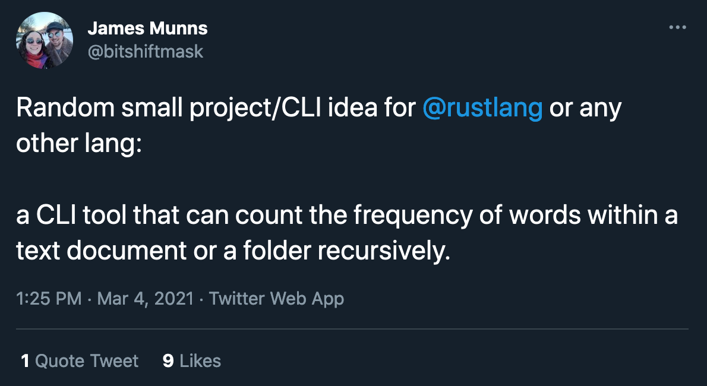

# freq

A commandline tool that counts the number of word occurences in an input.

[](https://twitter.com/bitshiftmask/status/1367451210987544580)

This is just a placeholder repository for now.
Please create issues for feature request and collaboration.

## TODO

- [ ] Ignore words ([regex pattern](https://docs.rs/regex/latest/regex/struct.RegexSet.html))
- [ ] Filter stopwords (similar to NLTK's stopwords)
- [ ] Different output formats (plaintext, JSON)
- [ ] Performance (SIMD support, async execution)
- [ ] Usage as library
- [ ] Recursion support
- [ ] Allow skipping files
- [ ] Allow specifying ignored words in a separate file
- [ ] Generate "heat bars" for words like shell-hist does
- [ ] Split report by file/folder (sort of like `sloc` does for code)
- [ ] Choose language for stopwords
- [ ] Format output (e.g. justify counts a la `uniq -c`)
- [ ] Interactive mode (shows stats while running)
- [ ] Calculate TF-IDF score in a multi-file scenario


Idea contributors:

- @jamesmunns
- @M3t0r
- @themihel
- Want to see your name here? Create an issue!

## Similar tools

**uniq**

A basic version would be

```
curl -L 'https://github.com/mre/freq/raw/main/README.md' | tr -cs '[:alnum:]' "\n" | grep -vEx 'and|or|for|a|of|to|an|in' | sort | uniq -c | sort
```

This works, but it's not very extensible by normal users.
It would also lack most of the features listed above.

**Lucene**

Has all the bells and whistles, but there is no official CLI interface and requires a full Java installation.

**wordcount**

```freqword <tab> freq```

Nice and simple. Doesn't exclude stopwords and no regex support, though.
https://github.com/juditacs/wordcount

**word-frequency**

Haskell-based approach: Includes features like min length for words, or min occurrences of words in a text.
https://github.com/cbzehner/word-frequency

**What else?**

There must be more tools out there. Can you help me find them?
