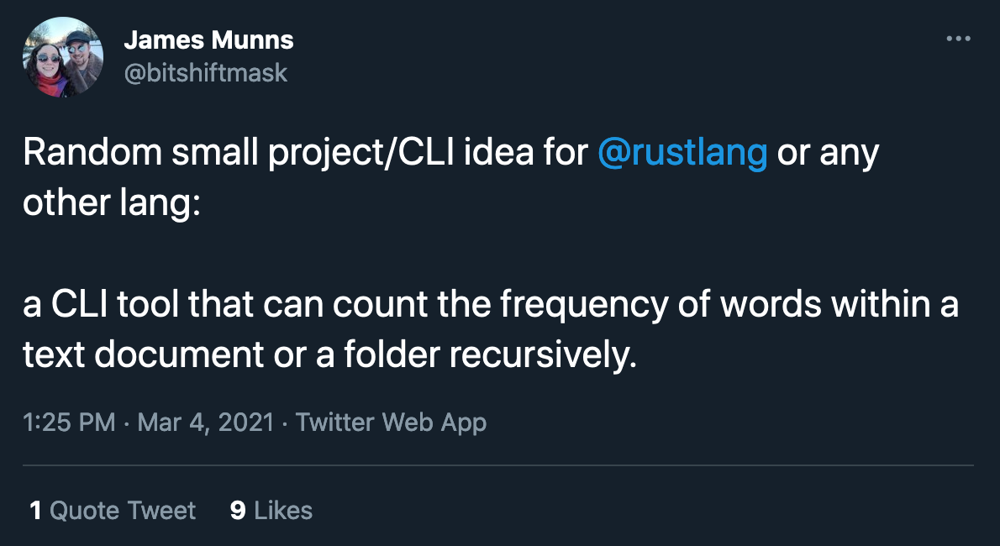

# freq

A commandline tool that counts the number of word occurrences in an input.

[](https://twitter.com/bitshiftmask/status/1367451210987544580)

This is just a placeholder repository for now.
Please create issues for feature request and collaboration.

## Usage

### Commandline

```sh
echo "b a n a n a" | freq

0.16666667 - 1 - b
0.33333334 - 2 - n
0.5 - 3 - a
```

### Library

```rust
use std::error::Error;

fn main() -> Result<(), Box<dyn Error>> {
    let frequencies = freq::count("fixtures/sample.txt")?;
    println!("{:?}", frequencies);
    Ok(())
}
```

## Features

- [x] Ignore words ([regex pattern](https://docs.rs/regex/latest/regex/struct.RegexSet.html)) [[issue 5](https://github.com/mre/freq/issues/5)]
- [x] Different output formats (plaintext, JSON)
- [x] freq.toml configuration file
- [x] Filter stopwords (similar to NLTK's stopwords)
- [ ] Performance (SIMD support, async execution)
- [ ] Recursion support
- [ ] Allow skipping files
- [ ] Allow specifying ignored words in a separate file
- [ ] Generate "heat bars" for words like shell-hist does
- [ ] Split report by file/folder (sort of like `sloc` does for code)
- [ ] Choose language for stopwords (`--lang fr`)
- [ ] Format output (e.g. justify counts a la `uniq -c`)
- [ ] Interactive mode (shows stats while running) (`--interactive`)
- [ ] Calculate TF-IDF score in a multi-file scenario
- [ ] Limit the output to the top N words (e.g. `--top 3`)
- [ ] Ignore hidden files (begins with `.`)
- [ ] Minimize number of allocations
- [ ] No-std support?
- [ ] Ignore "words" only consisting of special characters, e.g. `///`
- [ ] Multiple files as inputs
- [ ] Glob input patterns
- [ ] If directory is given, walk contents of folder recursively (walker)
- [ ] Verbose output (show currently analyzed file etc)
- [ ] Library usage
- [ ] https://github.com/jonhoo/evmap
- [ ] Automated abstract generation with Luhn's algorithm [Issue #1](https://github.com/mre/freq/issues/1)

Idea contributors:

- [@jamesmunns](https://github.com/jamesmunns)
- [@M3t0r](https://github.com/M3t0r)
- [@themihel](https://github.com/themihel)
- [@AlexanderThaller](https://github.com/AlexanderThaller)
- [@pizzamig](https://github.com/pizzamig)
- Want to see your name here? Create an issue!

## Similar tools

**tot-up**

Similar tool written in Rust with nice graphical output
https://github.com/payload/tot-up

**uniq**

A basic version would be

```sh,ignore
curl -L 'https://github.com/mre/freq/raw/main/README.md' | tr -cs '[:alnum:]' "\n" | grep -vEx 'and|or|for|a|of|to|an|in' | sort | uniq -c | sort
```

This works, but it's not very extensible by normal users.
It would also lack most of the features listed above.

**Lucene**

Has all the bells and whistles, but there is no official CLI interface and requires a full Java installation.

**wordcount**

`freqword <tab> freq`

Nice and simple. Doesn't exclude stopwords and no regex support, though.
https://github.com/juditacs/wordcount

**word-frequency**

Haskell-based approach: Includes features like min length for words, or min occurrences of words in a text.
https://github.com/cbzehner/word-frequency

**What else?**

There must be more tools out there. Can you help me find them?
